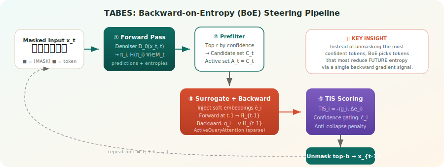

# TABES: Trajectory-Aware Backward-on-Entropy Steering for Masked Diffusion Models

[](https://arxiv.org/abs/2602.00250)
[](https://shreshthsaini.github.io/TABES/)


<p align="center">
  
</p>

## Authors

**[Shreshth Saini](https://shreshthsaini.github.io/)<sup>1</sup>, [Avinab Saha](https://scholar.google.com/citations?user=avinab_saha)<sup>2</sup>, [Balu Adsumilli](https://scholar.google.com/citations?user=balu_adsumilli)<sup>2</sup>, [Neil Birkbeck](https://scholar.google.com/citations?user=neil_birkbeck)<sup>2</sup>, [Yilin Wang](https://scholar.google.com/citations?user=yilin_wang)<sup>2</sup>, [Alan C. Bovik](https://www.ece.utexas.edu/people/faculty/alan-bovik)<sup>1</sup>**

<sup>1</sup>The University of Texas at Austin, <sup>2</sup>Google

## Overview

Masked Diffusion Models (MDMs) offer parallel decoding and bidirectional context for text generation, but current sampling methods rely on **local confidence heuristics** that ignore the long-term impact of unmasking decisions. This leads to **trajectory lock-in** — early hallucinations cascade into global incoherence.

**TABES** proposes **Backward-on-Entropy (BoE) Steering**, a training-free, model-agnostic inference framework that approximates infinite-horizon lookahead via a **single backward pass**. Instead of greedily unmasking the most confident tokens, BoE selects tokens that **most reduce future masked uncertainty**.

### Key Contributions

- **BoE Steering**: Formulates token unmasking as trajectory optimization, selecting actions by their predicted reduction in future masked entropy
- **Token Importance Score (TIS)**: A per-token score derived from a first-order expansion in embedding space that connects backward gradients to discrete token decisions
- **ActiveQueryAttention**: A sparse adjoint primitive that reduces backward pass complexity from O(L²d) to O(|A|·L·d), making gradient-guided steering practical
- **Anti-Collapse Regularizer**: Prevents premature overcommitment by penalizing overly confident early reveals

### How It Works

1. **Forward Pass**: Compute denoiser predictions and per-position entropies for all masked tokens
2. **Candidate Selection**: Pre-filter top candidates by confidence/margin
3. **Surrogate Construction**: Build a relaxed next-state using soft token embeddings
4. **Backward Signal**: Compute gradient of next-step masked entropy w.r.t. input embeddings
5. **TIS Scoring**: Score each candidate by `TIS = -⟨gradient, Δembedding⟩` — tokens with higher TIS reduce more future uncertainty
6. **Unmask**: Select top-b tokens by confidence-gated TIS scores

## Results

BoE achieves a **superior Pareto frontier** for inference-time scaling compared to existing unmasking methods on LLaDA-8B and LLaDA-1.5:

| Method | MBPP (256) | HumanEval (256) | GSM8K (256) | MATH500 (256) | Sudoku (256) |
|--------|-----------|----------------|------------|--------------|-------------|
| Confidence | 28.4 | 32.0 | 76.7 | 32.4 | 27.4 |
| LookUM | 36.2 | 35.9 | 79.3 | 34.6 | 28.0 |
| **BoE (ours)** | **37.4** | 33.1 | **80.6** | 34.2 | **29.2** |

## Project Page

🌐 **[https://shreshthsaini.github.io/TABES/](https://shreshthsaini.github.io/TABES/)**

## Repository Structure

```
├── docs/
│   ├── index.html              # Project landing page
│   └── assets/
│       ├── css/styles.css       # Shared styles
│       └── images/              # Diagrams and figures
├── CITATION.cff                 # Machine-readable citation
├── LICENSE                      # MIT License
└── README.md                   # This file
```

## Enable GitHub Pages

1. Push to GitHub:
   ```bash
   git add -A
   git commit -m "TABES project page and method blog"
   git push origin master
   ```

2. Go to **Settings → Pages** in your GitHub repo
3. Set **Source** to **Deploy from a branch**
4. Select branch **master** and folder **/docs**, then save

## Citation

If this work helps your research, please cite:

```bibtex
@misc{saini2026tabestrajectoryawarebackwardonentropysteering,
      title={TABES: Trajectory-Aware Backward-on-Entropy Steering for Masked Diffusion Models}, 
      author={Shreshth Saini and Avinab Saha and Balu Adsumilli and Neil Birkbeck and Yilin Wang and Alan C. Bovik},
      year={2026},
      eprint={2602.00250},
      archivePrefix={arXiv},
      primaryClass={cs.LG},
      url={https://arxiv.org/abs/2602.00250}, 
}
```

## License

Released under the MIT License. See `LICENSE`.
